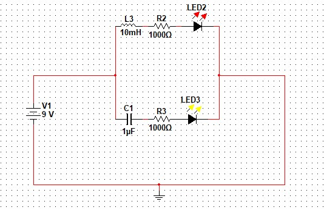
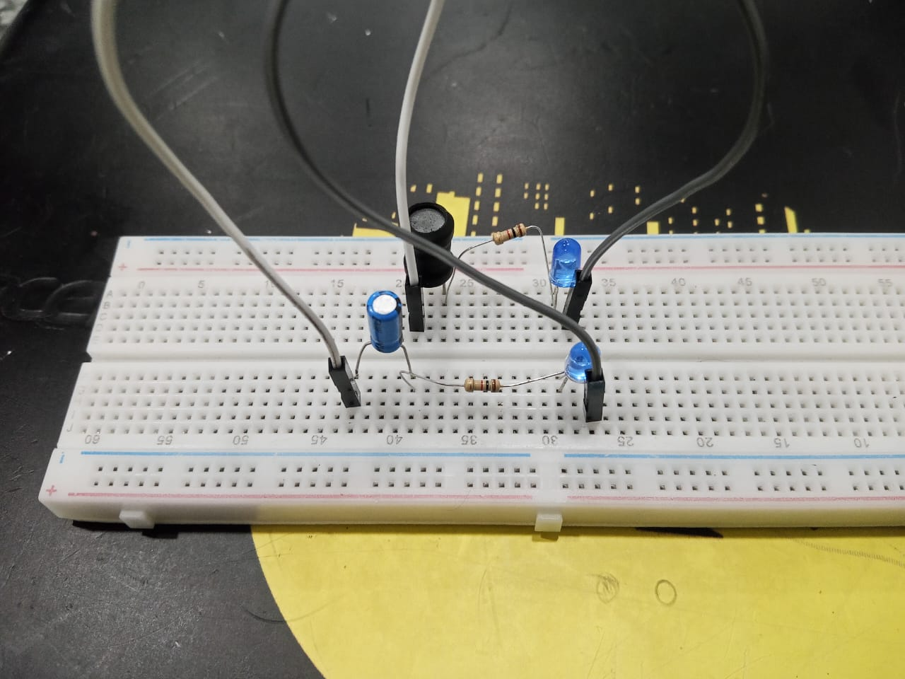
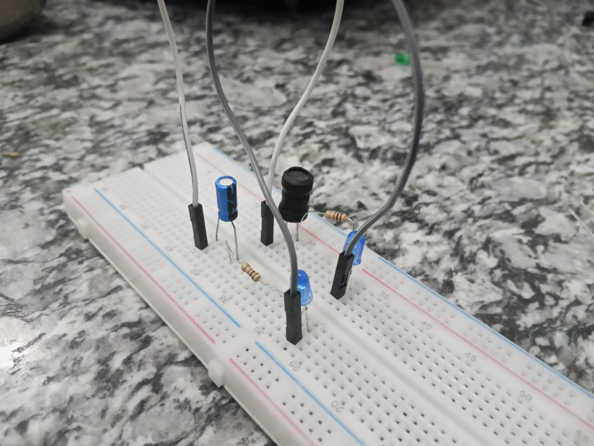
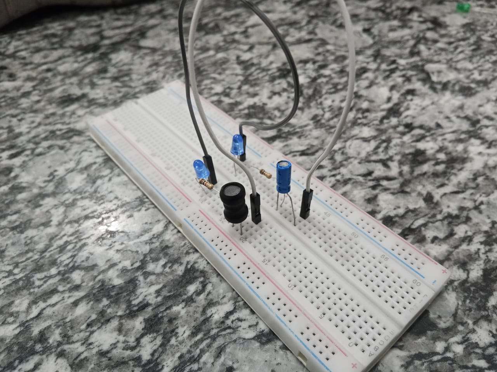

## 📘 Introduction
<b><u>Project Name:</u></b> We made a project by using inductor, capacitor and resistor. The circuit is parallel.

<b><u>Inductor:</u></b> Inductor is a passive electrical component that stores energy in a magnetic field when current flows through it and resists changes in current using the principle of self-inductance.

<b><u>Capacitor:</u></b> A capacitor is a passive electronic component that stores electrical energy in an electric field between its two conductive plates, separated by an insulating material (dielectric). It resists changes in voltage and is commonly used for energy storage, filtering, and signal processing.

<b><u>Resistor:</u></b> A resistor is a passive electronic component that opposes the flow of electric current, converting electrical energy into heat. It is used to control voltage and current in a circuit, with its resistance measured in ohms (Ω).

## 🖼️ Images
<i><b>Figure:1</b></i><i><b>Figure:2</b></i><i><b>Figure:3</b></i><i><b>Figure:4</b></i>
<caption><i>Clicked By SM.Mushfiqur Rahman</i></caption>

## ⚙️ How It Works
1. We use DC voltage in which frequency is 0. 
2. When the current passes through the inductor it will act as an short circuit then the bulb will be lighten.
3. When the current passes through the capacitor it will act as an open circuit then the bulb will not be lighten.

## 👥 Contribution
1. 👤 [Sanjida Akter](mailto:23-54146-3@student.aiub.edu)
2. 👤 [MD.Rafiul Islam Rifat](mailto:23-55141-3@student.aiub.edu)
3. 👤 [SM.Mushfiqur Rahman](mailto:23-55124-3@student.aiub,edu)
4. 👤 [Rafa Jahan](mailto:23-54836-3@student.aiub.edu)
5. 👤 [MD.Minhajul Shariar Zaman Alif](mailto:23-54144-3@student.aiub.edu)

<b><i>Contact with them if you face any kinds of problem</i></b>

<b><i>You need a Multisim software to view the "Parallel_bulb.ms11" file</i></b>

